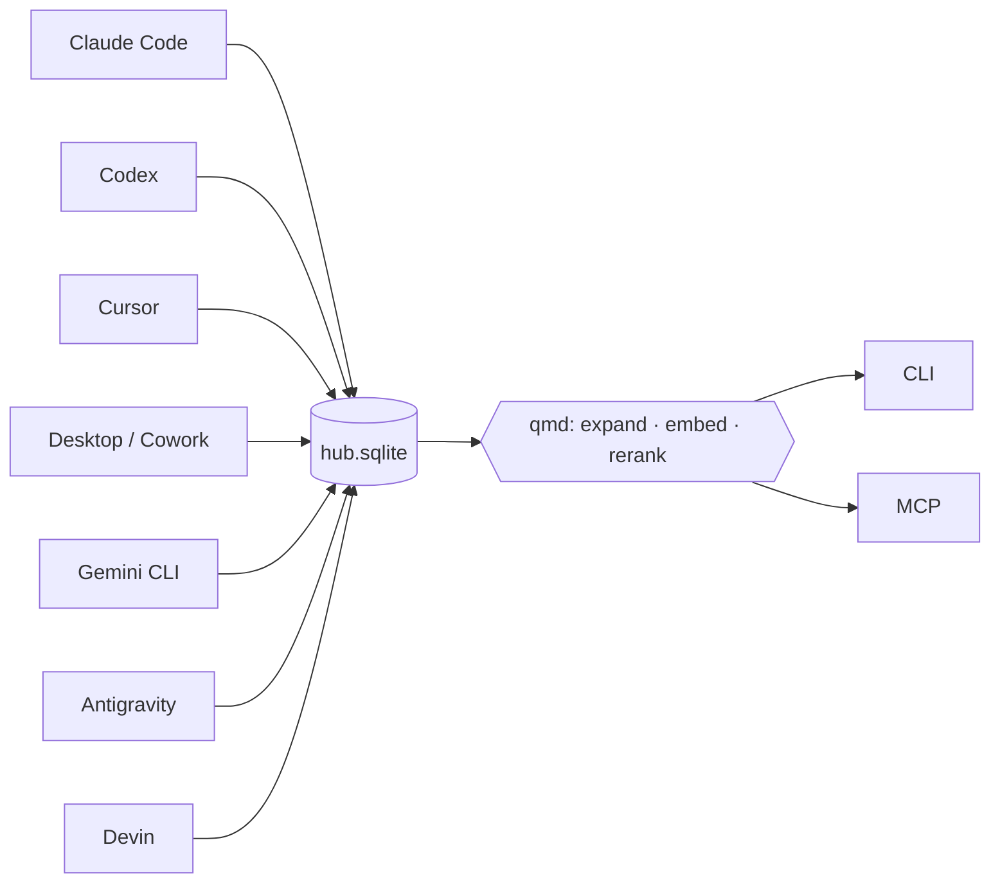

<div align="center">


# centered-agent-memory

[](CHANGELOG.md)
[](https://github.com/arlinamid/centered-agent-memory/actions/workflows/ci.yml)
[](https://github.com/arlinamid/centered-agent-memory/blob/main/README.hu.md#telep%C3%ADt%C3%A9s)

Egy index a gép minden AI kódoló eszközéről — Claude Code, Claude Desktop / Cowork, Codex, Cursor, Gemini CLI, Antigravity, Devin — projektenként. CLI és MCP, hogy bármelyik ágens megnézhesse, mit csináltak a többiek.

[English](README.md) · [docs](docs/install.hu.md) · [English docs](docs/install.md)


</div>

```
$ cam dossier demo

# demo  (D:/work/demo)

47 session · 1820 turn · 6 subagent thread(s)

## Tools
  cursor             22 session    980 turn  2026-03-02 → 2026-08-28
  claude_code        14 session    610 turn  2026-04-11 → 2026-08-27
  codex              11 session    230 turn  2026-05-01 → 2026-08-20

## Attribution
  strong:38  medium:7  none:2

## Recent topics
  2026-08-28  cursor         Docker port 80
  2026-08-27  claude_code    recall ranking

$ cam recall "docker port"

2026-06-07 14:22  cursor  demo  · Docker port
  You moved the Docker port from 3000 to 80
  cursor:9f2a1c…#seq12-18

1 hit(s). Marks: ~ medium, ? weak, ?? unattributed project.
```

A termék (CLI, MCP, skill) angolul beszél. A fenti kimenet szándékosan az igazi.

Referenciagép: **1 643** session, **32 054** turn — kollektor-ellenőrzés ~**330 ms**, `cam recall` **55 ms**, `cam dossier` **8 ms**, ismételt `cam sync` ~**4,6 s**.



Az index **hivatkozásokat** tárol, nem másolatot. A források read-onlyak. Semmi nem hagyja el a gépet.

| Szabály | Mit jelent |
|---|---|
| Hivatkozás, nem másolat | Egy turn: fájl + bájt-offset, vagy SQLite-kulcs. A szöveget lekérdezéskor olvassuk vissza. Kivétel a múlandó scratchpad (`artifacts`). |
| Nem tippelünk | Ismeretlen projekt `unattributed` marad. Minden találat megnevezi a jelet és a megbízhatóságot (`strong` / `medium` / `weak` / `none`). |
| A forrás read-only | Szerkezeti: `openSourceReadonly`. A `cam` sosem ír másik ágens tárolójába. |
| Opcionális modellhasználat | Nincs telemetria. Az álomfázis, az embedding és a frissítés külön bekapcsolást igényel. A generálás kiírja a tervezett szövegmennyiséget; bekapcsolt szemantikus keresésnél a kérdés szövege is átkerül a beállított embedding parancshoz. |
| Megmondja, milyen régi | Minden MCP-válasz az index korával végződik. A `STALE` azt jelenti: ne idézd frissként. |
| Relevancia a gépen | A találatokat a beépített [qmd](https://github.com/tobi/qmd) modellek rangsorolják újra (embeddinggemma-300M, Qwen3-Reranker-0.6B). Amit a modell elutasít, azt eldobjuk — a kevés találat kevés *releváns* találatot jelent. |
| Fájlok és megjegyzések | A `cam docs` indexeli a projekt saját fájljait (`.ts`, `.tsx`, `.js`, …), a `cam note` pedig egy mondatot fűz egy útvonalhoz — azt, amit a kódbázis nem tud magáról elmondani. |

---

## Telepítés

> [!IMPORTANT]
> Node **24+** (aktív LTS). Nincs fent az npm registryn — checkoutból, aztán a tarballból.

```bash
git clone https://github.com/arlinamid/centered-agent-memory.git
cd centered-agent-memory
npm ci --ignore-scripts
npm pack
npm install -g --ignore-scripts ./centered-agent-memory-*.tgz
cam install --dry-run          # a terv
cam install                    # MCP, skill, ütemezés
```

A `cam install` beköti a szervert minden megtalált ágens-eszközbe, melléteszi a skillt, ad az álom fázisnak modellt a gépen már meglévő CLI-k közül, megkérdezi, hova kerüljenek a relevancia-modellek, és beállítja az óránkénti frissítést. Kikapcsolók: [`docs/install.hu.md`](docs/install.hu.md).

**Hova kerülnek a modellek.** A relevancia-réteg három helyi GGUF modellt használ, összesen valamivel több mint 2 GB. A telepítő javasol egy helyet, te pedig Entert nyomsz vagy megadsz másikat — azért kérdés, mert a home könyvtár meghajtóján gyakran épp nincs hely, és a rossz tipp félbeszakadt letöltéssel végződik:

```
relevance models (~2.4 GB): ~/.cache/qmd/models
  0/3 cached · 13.1 GB free
  Keep them there? [Y/n]
```

Telepítéskor semmi nem töltődik le; a súlyok az első használatkor érkeznek. A `cam install --models <útvonal>` kérdés nélkül válaszol, a `--no-models` pedig békén hagyja a beállítást.

A Claude Code (és a Claude Code Desktop, ugyanaz a mappa) skilljét külön is fel lehet tenni:

```bash
npx skills add arlinamid/centered-agent-memory --skill agent-memory --agent claude-code -g -y
```

> [!WARNING]
> **A szervert ne `npx`-ből kösd be.** A gyorsítótárat később kitakarítják, a bekötés némán meghal. A telepítő ezt felismeri, nem ír semmit, és `npm i -g`-t javasol. Egyszeri lekérdezésre az `npx` jó — az index a felhasználói adatmappában van.

<details>
<summary>Miért tarball, és miért <code>--ignore-scripts</code></summary>

Az `npm link` és az `npm install -g .` is a checkoutra **linkel**. A checkout elmozdítása vagy törlése az imént bekötött klienseket viszi magával. A tarball önálló másolat.

Ebben a függőségi fában egyetlen telepítő szkriptre sincs szükség. Az SQLite-kötés hoz prebuildet, az npm mégis lefuttatná a `node-gyp rebuild`-et — ami Windowson Visual Studiót keres egy üres projekthez. Az `--ignore-scripts` azt a fordítót ugorja át, ami nem kell.

</details>

<details>
<summary>Hol van az index, és hogyan mozgatod</summary>

Windowson `%LOCALAPPDATA%\centered-agent-memory\hub.sqlite`, máshol `$XDG_DATA_HOME/centered-agent-memory/hub.sqlite` (vagy `~/.local/share/...`). A checkout, amelyikben már van `.data/hub.sqlite`, azt használja. A `cam doctor` kiírja az érvényes útvonalakat.

Felülírás: `--db <útvonal>`, `CAM_DB`, vagy a konfig (`%APPDATA%\centered-agent-memory\config.json` / `$XDG_CONFIG_HOME/centered-agent-memory/config.json`, `CAM_CONFIG` mozgatja):

```json
{
  "dbPath": "D:/index/hub.sqlite",
  "roots": { "codexStateDb": "D:/codex/state_5.sqlite" }
}
```

A `roots` alatt mind a tíz tárolóhely felülírható.

</details>

---

## Gyors indítás

```bash
cam sync                       # inkrementális beolvasás
cam projects                   # amit az index ismer
cam dossier <projekt>          # egy projekt, minden eszköz
cam recall "ahogy megbeszéltük" # helyben újrarangsorolva; a lényegtelent eldobja
cam get cursor:9f2a…#seq12-18  # a recall által adott hivatkozás

cam docs add .                 # a projekt saját fájljainak indexelése
cam docs query "hol dől el X"  # .ts, .tsx, .js, .py … szintaxis szerint darabolva
cam note add src/a.ts "…"      # mire való a fájl; minden találat hozza
```

Közös kapcsolók: `--json`, `--since` / `--until`, `--tool <eszköz>`, `--subagents`, `--include-weak`, `--limit N`, `--db <útvonal>`, `--quiet`, `--verbose`. Kilépés `0` / `1` / `2` = rendben / hiba / használat. Két `cam sync` közül a második kilép.

A `--quiet` csak hibánál beszél. A választ sosem nyeli el: a `cam recall --json --quiet` kiírja a JSON-t.

---

## MCP

```bash
cam install                    # bekötés minden kliensbe
cam-mcp                        # vagy kézzel: stdio, JSON-RPC a stdout-on
```

Nyolc csak-olvasó tool: `cam_dossier`, `cam_docs`, `cam_timeline`, `cam_recall`, `cam_get`, `cam_projects`, `cam_memory`, `cam_status`. Bekötés: [`docs/mcp.hu.md`](docs/mcp.hu.md).

Minden válasz — a hibás is — az index korával végződik:

```
— index: 2026-08-29 17:37 UTC (1 min ago) · 1643 session · 32054 turn
```

24 óra után (`staleAfterHours`) a sor azt írja: `STALE, run: cam sync`, és a szerver utasítása megmondja az ágensnek, hogy ezt jelentse, ne idézze a régit frissként. A lábléc a tool-regisztrációba van kötve, későbbi tool sem hagyhatja ki.

---

## Mit olvas be

| Eszköz | Forrás | Projekt-kulcs |
|---|---|---|
| Claude Code | `~/.claude/projects/<slug>/*.jsonl` + `<id>/subagents/*.jsonl` | rekordbeli `cwd` |
| Codex | `~/.codex/state_5.sqlite` + a rollout fájlok | `threads.cwd` / `session_meta.cwd` |
| Cursor | `<appdata>/Cursor/User/globalStorage/state.vscdb` | fájlútvonalak a beszélgetésből |
| Cowork | `<appdata>/Claude/local-agent-mode-sessions/**` | `userSelectedFolders` |
| Claude Desktop | `<appdata>/Claude/claude-code-sessions/**` | index + cím |
| Cursor előzmények | `<appdata>/Cursor/User/History/*/entries.json` | idő-korreláció bemenete |
| Gemini CLI | `~/.gemini/tmp/<projekt>/chats/session-*.json` | `.project_root` a chatek mellett |
| Antigravity | `~/.gemini/antigravity-cli/conversation_summaries.db` + `history.jsonl` + `brain/**/*.md` | `workspace_uris` |
| Devin CLI | `<appdata>/devin/cli/sessions.db` | `sessions.working_directory` |
| Devin asztali / Windsurf | `~/.codeium/windsurf/cascade/<uuid>.pb` (titkosított; törzs a `cam get`-tel) | `workspace_uris` az élő language serverből |

Az Antigravity beszélgetés-törzsei (`conversations/*.pb`) titkosítottak — mérve 7,998 bit entrópia bájtonként —, ezért az összefoglalót, a begépelt promptokat és az ügynök terv-dokumentumait indexeljük. A `cam get antigravity:<id>` az élő language servertől kéri a törzset. A Devin asztali / Windsurf Cascade ugyanez a titkosított store összefoglaló adatbázis nélkül: a `cam sync` a fájlnevet jegyzi, a `cam get devin:<id>` ugyanígy hozza a szöveget.

Formátumok és buktatók: [`docs/sources.hu.md`](docs/sources.hu.md). Séma: [`docs/architecture.hu.md`](docs/architecture.hu.md).

---

## Memória

Egy emlék attól lesz hosszú távú, hogy **többször, több napon, többféle kérdésre** előjött — nem attól, hogy fontosnak látszik. Modell nem kell. Kapuk: ≥ 3 előhívás, ≥ 3 különböző kérdés, pontszám ≥ 0,8.

```bash
cam memory consolidate         # a nyomból promóció
cam memory list                # a promotált emlékek
cam memory show <id>           # egy emlék a bizonyítékával
cam memory dream [--dry-run]   # opcionális mondat, beállított modelltől
```

Ugyanaz az adatbázis, ugyanaz a promóció. A promotált emlék sem tárol szöveget — chunk-hivatkozás. Részletek: [`docs/memory.hu.md`](docs/memory.hu.md).

A `cam memory dream` alapból ki van kapcsolva, a `consolidate` sosem hívja, kiírja, mi menne ki *mielőtt* kimegy, és a generált mondatot a modell nevével címkézi.

## Relevancia a gépen

A recall korábban azt adta vissza, ami szó szerint egyezett. Most a találatokat egy helyi cross-encoder pontozza, és amit elutasít, azt **eldobjuk**, nem hátrasoroljuk — a kevés találat tehát kevés *releváns* találatot jelent, nem vékony indexet. Három GGUF modell dolgozik, mind a gépen, semmi nem megy ki:

| lépés | modell | alapértelmezés |
|---|---|---|
| újrarangsorolás | Qwen3-Reranker-0.6B-Q8_0 | be |
| beágyazás | embeddinggemma-300M-Q8_0 | `memory.embedding.provider: "qmd"` |
| kérdés-kiterjesztés | qmd-query-expansion-1.7B-q4_k_m | ki — mérve ~74 s új kérdésenként |

```bash
cam recall "miért változott a docker port"   # újrarangsorolva
cam recall "docker" --no-rerank              # a nyers találati halmaz
cam recall "docker" --min-score 0.1          # lazább küszöb
cam dossier <projekt> --focus "attribution"  # relevancia szerint, nem méret szerint
```

Az indexelésnél is vágunk: a tool-hívás blokkok, hosszú diffek és bemásolt fájlok számlált jelölőkké válnak (`[42 lines elided]`), így az index beszélgetést tárol, nem gépezetet. Ez megváltoztatja az indexelt szöveget, ezért verziózott — a `cam doctor` szól, ha egy hubnak `cam rebuild` kell.

**Visszaesik, nem akad meg.** A hiányzó vagy még töltődő modell pontosságba kerül, sosem találatba: minden lépés figyelmeztetéssel esik vissza. Egy modell betöltése kb. egy perc natív, megszakíthatatlan munka, ezért az MCP szerver nem tölt be modellt, amíg a `memory.qmd.warmUp` nem kéri — azonnal válaszol, modell nélkül, és ezt ki is mondja —, a terminálban futó `cam recall` viszont megvárja, mert egy egyszeri parancsnak nincs következő kérdése. A `CAM_QMD=0` egy futásra kikapcsolja a réteget. Számok és indoklás: [`docs/memory.hu.md`](docs/memory.hu.md).

---

## A projekt saját fájljai

A beszélgetések hivatkozásként maradnak a hubban. A projekt **fájljai** a qmd indexébe kerülnek, szintaxis szerint darabolva — így a találat egy függvényre esik, nem annak a közepére —, és mindegyikhez tartozhat egy megjegyzés arról, mire való.

```bash
cam docs add . --project myapp               # ts, tsx, js, py, go, rs, md …
cam docs index                               # beolvasás és beágyazás
cam docs query "hol dől el az auth"
cam note add src/auth/session.ts "A refresh szándékos; lásd RFC-14."
cam note list
```

A megjegyzés az, amit a kódbázis nem tud magáról elmondani — miért létezik egy modul, mihez ne nyúlj. Minden fájl-találat hozza az útvonalához tartozó megjegyzést, és a legpontosabb nyer: a `src/auth/`-ra írt a mappát írja le, a `src/auth/session.ts`-re írt pedig felülírja arra a fájlra. A `node_modules`, a `dist` és a lock fájlok alapból kimaradnak. Ágensből ugyanez a `cam_docs`.

---

## Frissítés

A `cam update --check` összeveti a telepített verziót a legutóbbi GitHub release-szel; a `cam update --yes` telepíti. Mindkettő ki van kapcsolva, amíg a konfigurációs fájl nem mondja, hogy `{"update": {"enabled": true}}`, a `cam update --dry-run` pedig megmutatja, mit keresne meg — anélkül, hogy megkeresné.

A frissítés előbb leállítja a futó `cam-mcp` szervereket (az MCP kliens a következő eszközhívásnál újat indít), felveszi a sync-lockot, hogy ütemezett futás ne ütközzön bele, és — ha épp azt a példányt cserélné le, amelyik fut — egy ideiglenes könyvtárba írt szkriptre bízza a telepítést, ami megvárja a folyamat kilépését. Az indexet ezután azonnal az újonnan telepített bináris migrálja, nem hajnali 4-kor egy felügyelet nélküli job. Az újabb verzió által írt indexet visszautasítja, nem bélyegzi vissza csendben.

---

## Felügyelet nélkül

Ezt a hármat a `cam install` állítja be. Task Scheduler, launchd, systemd, cron: [`docs/operations.hu.md`](docs/operations.hu.md).

```bash
cam sync --quiet                # óránként
cam memory consolidate --quiet  # naponta
cam prune --quiet               # naponta
```

A megőrzés a régi keresési nyomot, a fölös futásnaplót és — csak ha kéred — az eltűnt forrású sessionöket viszi. **Élő promóció bizonyítéka nem törölhető.**

A `cam forget` az *indexből* töröl, nem a történelemből. A beszélgetésfájlokhoz nem nyúl; a következő sync újraindexeli őket, ha még megvannak.

---

<details>
<summary>Parancsjegyzék</summary>

```bash
cam sync [--repair] [--tool t] # források (inkrementális, vagy teljes)
cam projects [--unattributed]  # projektek, vagy a be nem sorolt sessionök
cam timeline <projekt>         # minden eszköz, időrendben
cam dossier <projekt>          # egy projekt teljes képe
cam recall "<kérdés>"          # teljes szövegű keresés
cam get <tool:id[#seqN-M]>     # hivatkozás mögötti szöveg
cam alias <mappa> <projekt>    # két mappa egy projektté
cam attribute <tool:id> <proj> # kézi hozzárendelés
cam reattribute                # újraszámolás tároló-olvasás nélkül
cam rebuild                    # szövegindex a forrásokból
cam memory <alparancs>         # hosszú távú memória
cam status                     # utolsó szinkron, tartalom
cam doctor                     # állapotjelentés
cam prune [--vacuum]           # megőrzés
cam forget --project <p>       # egy projekt vagy session
cam backup [<fájl>]            # ellenőrzött másolat
cam install [--dry-run]        # bekötés; cam uninstall visszavonja
```

Ha az adatbázis megsérül, a `cam doctor` megmondja, mi baja. A `cam rebuild` a **szövegindexet** építi újra a forrásokból — erre a `cam sync --repair` nem képes, mert a contentless FTS nem építhető újra magából az adatbázisból.

</details>

<details>
<summary>Mit tart az adatbázis</summary>

Hivatkozásokat, contentless FTS-indexet (invertált index, szöveg nélkül), metaadatot (cím, időbélyeg, munkakönyvtár), projekt-bizonyítékot (fájlútvonalak), a múlandó melléktermékek másolatát, és — mert a promóciónak meg kell mutatnia, milyen kérdések hozták elő — **a saját kereséseid szövegét** (`logQuery: false` csak a hasht tartja).

A beszélgetések szövegét **nem**. Semmi nem megy sehova. A `hub.sqlite` törlése az indexet viszi, a forrást nem.

</details>

---

## Docs

| | Magyar | English |
|---|---|---|
| Telepítés | [`docs/install.hu.md`](docs/install.hu.md) | [`docs/install.md`](docs/install.md) |
| MCP | [`docs/mcp.hu.md`](docs/mcp.hu.md) | [`docs/mcp.md`](docs/mcp.md) |
| Üzemeltetés | [`docs/operations.hu.md`](docs/operations.hu.md) | [`docs/operations.md`](docs/operations.md) |
| Memória | [`docs/memory.hu.md`](docs/memory.hu.md) | [`docs/memory.md`](docs/memory.md) |
| Források | [`docs/sources.hu.md`](docs/sources.hu.md) | [`docs/sources.md`](docs/sources.md) |
| Felépítés | [`docs/architecture.hu.md`](docs/architecture.hu.md) | [`docs/architecture.md`](docs/architecture.md) |
| Terv | [`docs/roadmap.hu.md`](docs/roadmap.hu.md) | [`docs/roadmap.md`](docs/roadmap.md) |
| Changelog | | [`CHANGELOG.md`](CHANGELOG.md) |

```bash
npm test          # vitest; valódi tárolót egy teszt sem olvas
npx tsc --noEmit  # típusellenőrzés
```

A tesztek a Cursor / Codex fixtúrákat futásidőben építik a valódi DDL-lel. Az útvonal-hajtás rögzített (`CAM_CASE_FOLD`); a CI Windowson, macOS-en és Linuxon fut.

MIT — [`LICENSE`](LICENSE).
