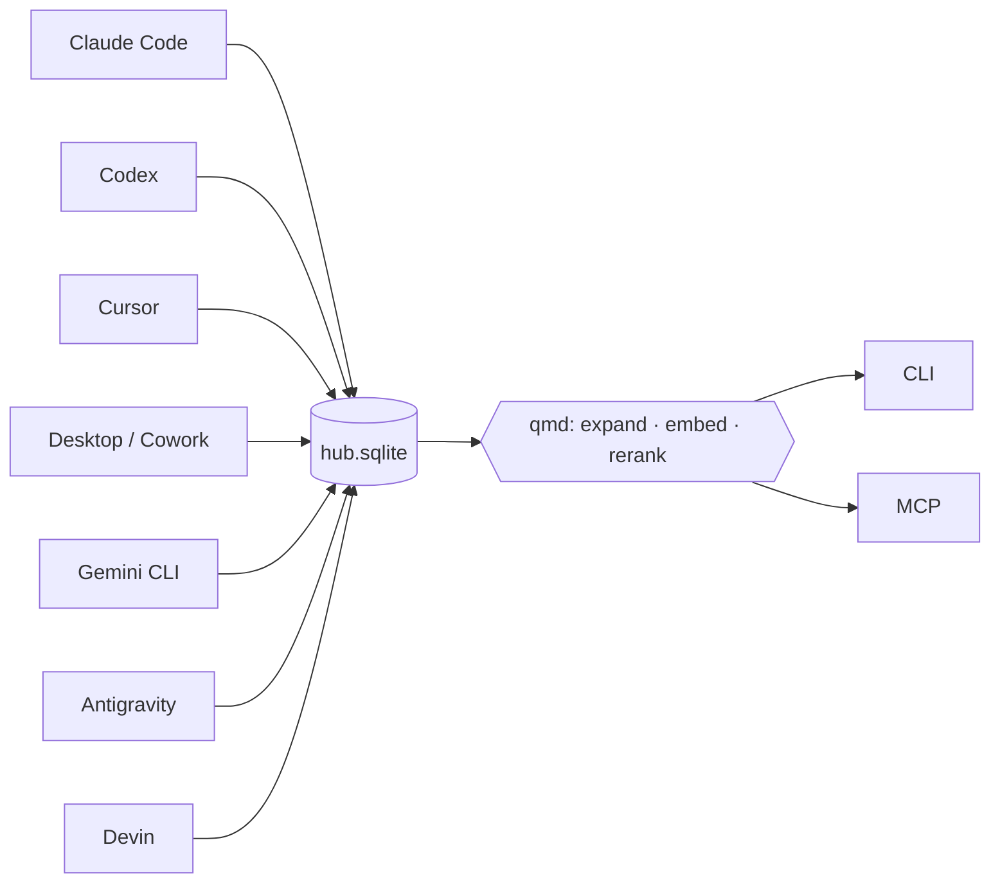

<div align="center">


# centered-agent-memory

[](CHANGELOG.md)
[](https://github.com/arlinamid/centered-agent-memory/actions/workflows/ci.yml)
[](https://github.com/arlinamid/centered-agent-memory#install)

One index over every AI coding tool on the machine — Claude Code, Claude Desktop / Cowork, Codex, Cursor, Gemini CLI, Antigravity, Devin — organised by project. CLI and MCP, so any agent can look up what the others already did.

[Magyar](README.hu.md) · [docs](docs/install.md) · [`docs/*.hu.md`](README.hu.md)


</div>

```
$ cam dossier demo

# demo  (D:/work/demo)

47 session · 1820 turn · 6 subagent thread(s)

## Tools
  cursor             22 session    980 turn  2026-03-02 → 2026-08-28
  claude_code        14 session    610 turn  2026-04-11 → 2026-08-27
  codex              11 session    230 turn  2026-05-01 → 2026-08-20

## Attribution
  strong:38  medium:7  none:2

## Recent topics
  2026-08-28  cursor         Docker port 80
  2026-08-27  claude_code    recall ranking

$ cam recall "docker port"

2026-06-07 14:22  cursor  demo  · Docker port
  You moved the Docker port from 3000 to 80
  cursor:9f2a1c…#seq12-18

1 hit(s). Marks: ~ medium, ? weak, ?? unattributed project.
```

Reference machine: **1,643** sessions, **32,054** turns — collector check ~**330 ms**, `cam recall` **55 ms**, `cam dossier` **8 ms**, repeat `cam sync` ~**4.6 s**.



The index stores **locators**, not copies. Sources stay read-only. Nothing leaves the machine.

| Rule | Meaning |
|---|---|
| Locators, not copies | A turn is a file + byte offset, or an SQLite key. Text is re-read at query time. Volatile scratchpads are the one exception (`artifacts`). |
| No guessing | Unknown project stays `unattributed`. Every hit names its signal and confidence (`strong` / `medium` / `weak` / `none`). |
| Sources are read-only | Structural: `openSourceReadonly`. The tool never writes another agent's store. |
| Optional model access | No telemetry. Dreaming, embeddings, and updates are opt-in. Embedding and dream generation report planned text volume; enabling semantic recall also hands query text to your configured embedding command. |
| Says how old it is | Every MCP answer ends with the index age. `STALE` means do not quote it as current. |
| Relevance, on device | Results are reranked by bundled [qmd](https://github.com/tobi/qmd) models (embeddinggemma-300M, Qwen3-Reranker-0.6B). Passages the model rejects are dropped, so few hits means few relevant hits. |
| Files and notes | `cam docs` indexes the project's own files (`.ts`, `.tsx`, `.js`, …) and `cam note` attaches a sentence to a path — the part a codebase cannot state about itself. |

---

## Install

> [!IMPORTANT]
> Node **24+** (active LTS). Not on the npm registry — install from a checkout, then from the tarball.

```bash
git clone https://github.com/arlinamid/centered-agent-memory.git
cd centered-agent-memory
npm ci --ignore-scripts
npm pack
npm install -g --ignore-scripts ./centered-agent-memory-*.tgz
cam install --dry-run          # read the plan
cam install                    # wire MCP, skill, schedule
```

`cam install` registers the server with every agent tool it finds, writes a skill, picks an optional dream model from a CLI already on the machine, asks where to keep the relevance models, and schedules hourly refresh. Opt-outs and the full plan: [`docs/install.md`](docs/install.md).

**Where the models go.** The relevance layer uses three local GGUF models, a little over 2 GB in total. The installer proposes a location and you press Enter or name another — it is a question because the drive a home directory sits on is often the one with no room left, and guessing wrong ends in a half-finished download:

```
relevance models (~2.4 GB): ~/.cache/qmd/models
  0/3 cached · 13.1 GB free
  Keep them there? [Y/n]
```

Nothing is downloaded during install; the weights arrive on first use. `cam install --models <path>` answers it without a prompt, and `--no-models` leaves the setting alone.

Claude Code (and Claude Code Desktop, same folder) can take the skill alone:

```bash
npx skills add arlinamid/centered-agent-memory --skill agent-memory --agent claude-code -g -y
```

> [!WARNING]
> **Do not wire the server through `npx`.** The cache is collected later and the entry dies silently. The installer detects that, writes nothing, and points at `npm i -g`. `npx` is fine for a one-off query — the index lives in a user data directory.

<details>
<summary>Why the tarball, and why <code>--ignore-scripts</code></summary>

`npm link` and `npm install -g .` both **link** back to the checkout. Move or delete the checkout and every client you just wired breaks. The tarball is a self-contained copy.

Nothing in this dependency tree needs an install script. The SQLite binding ships a prebuilt binary, yet npm would still run `node-gyp rebuild` — which on Windows looks for Visual Studio to produce an empty project. `--ignore-scripts` skips a compiler you do not need.

</details>

<details>
<summary>Where the index lives, and how to move it</summary>

`%LOCALAPPDATA%\centered-agent-memory\hub.sqlite` on Windows, `$XDG_DATA_HOME/centered-agent-memory/hub.sqlite` (or `~/.local/share/...`) elsewhere. A checkout that already has `.data/hub.sqlite` keeps using it. `cam doctor` prints the paths in use.

Override with `--db <path>`, `CAM_DB`, or the config file (`%APPDATA%\centered-agent-memory\config.json` / `$XDG_CONFIG_HOME/centered-agent-memory/config.json`, moved by `CAM_CONFIG`):

```json
{
  "dbPath": "D:/index/hub.sqlite",
  "roots": { "codexStateDb": "D:/codex/state_5.sqlite" }
}
```

Any of the ten store locations can be overridden under `roots`.

</details>

---

## Quick start

```bash
cam sync                       # incremental read of every source
cam projects                   # what the index knows
cam dossier <project>          # one project, every tool
cam recall "as we discussed"   # reranked locally; irrelevant hits dropped
cam get cursor:9f2a…#seq12-18  # the citation recall printed

cam docs add .                 # index this project's own files
cam docs query "where is X"    # .ts, .tsx, .js, .py … chunked by syntax
cam note add src/a.ts "…"      # what a file is for; every hit carries it
```

Shared flags: `--json`, `--since` / `--until`, `--tool <tool>`, `--subagents`, `--include-weak`, `--limit N`, `--db <path>`, `--quiet`, `--verbose`. Exit `0` / `1` / `2` = ok / fail / usage. A second `cam sync` steps back from the first.

`--quiet` speaks only on failure. It never swallows the answer: `cam recall --json --quiet` still prints JSON.

---

## MCP

```bash
cam install                    # register with every client on the machine
cam-mcp                        # or start by hand: stdio, JSON-RPC on stdout
```

Eight read-only tools: `cam_dossier`, `cam_docs`, `cam_timeline`, `cam_recall`, `cam_get`, `cam_projects`, `cam_memory`, `cam_status`. Wiring: [`docs/mcp.md`](docs/mcp.md).

Every response — including errors — ends with the index age:

```
— index: 2026-08-29 17:37 UTC (1 min ago) · 1643 session · 32054 turn
```

Past 24 hours (`staleAfterHours`) the line says `STALE, run: cam sync`, and the server's instructions tell the agent to report that rather than quote old data as current. The footer is wired into tool registration, so a later tool cannot omit it.

---

## What it reads

| Tool | Source | Project key |
|---|---|---|
| Claude Code | `~/.claude/projects/<slug>/*.jsonl` + `<id>/subagents/*.jsonl` | `cwd` in the records |
| Codex | `~/.codex/state_5.sqlite` + the rollout files | `threads.cwd` / `session_meta.cwd` |
| Cursor | `<appdata>/Cursor/User/globalStorage/state.vscdb` | file paths in the conversation |
| Cowork | `<appdata>/Claude/local-agent-mode-sessions/**` | `userSelectedFolders` |
| Claude Desktop | `<appdata>/Claude/claude-code-sessions/**` | index + title |
| Cursor history | `<appdata>/Cursor/User/History/*/entries.json` | time-correlation input |
| Gemini CLI | `~/.gemini/tmp/<project>/chats/session-*.json` | `.project_root` beside the chats |
| Antigravity | `~/.gemini/antigravity-cli/conversation_summaries.db` + `history.jsonl` + `brain/**/*.md` | `workspace_uris` |
| Devin CLI | `<appdata>/devin/cli/sessions.db` | `sessions.working_directory` |
| Devin desktop / Windsurf | `~/.codeium/windsurf/cascade/<uuid>.pb` (encrypted; body on `cam get`) | `workspace_uris` from the live language server |

Antigravity's conversation bodies (`conversations/*.pb`) are encrypted — measured at 7.998 bits of entropy per byte — so what is indexed is the summary, the typed prompts and the agent's plan documents. `cam get antigravity:<id>` asks the live language server for the body. Devin desktop / Windsurf Cascade is the same encrypted store without a summaries database: `cam sync` records the filename, and `cam get devin:<id>` fetches the text the same way.

Formats and traps: [`docs/sources.md`](docs/sources.md). Schema: [`docs/architecture.md`](docs/architecture.md).

---

## Memory

A memory becomes long-term because it came back **several times, on several days, to several different questions** — not because it looked important. No model required. Gates: ≥ 3 recalls, ≥ 3 distinct queries, score ≥ 0.8.

```bash
cam memory consolidate         # fold the trace, promote what earned it
cam memory list                # the promoted memories
cam memory show <id>           # one memory with the evidence
cam memory dream [--dry-run]   # optional sentence, written by a model you configure
cam memory embed [--dry-run]   # optional vectors, using an embedding command you configure
```

Same database, same promotions. A promoted memory stores no text either — it references a chunk. Details: [`docs/memory.md`](docs/memory.md).

`cam memory dream` is off by default, never runs from `consolidate`, prints what would leave the machine before it leaves, and labels every generated sentence with the model that wrote it.

## Relevance, on device

Recall used to return whatever matched lexically. Now the results are scored by a local cross-encoder and the ones it rejects are **dropped**, not pushed down the list — so a short answer means little was relevant, not that the index is thin. Three GGUF models do the work, all on the machine, nothing leaving it:

| stage | model | default |
|---|---|---|
| reranking | Qwen3-Reranker-0.6B-Q8_0 | on |
| embedding | embeddinggemma-300M-Q8_0 | `memory.embedding.provider: "qmd"` |
| query expansion | qmd-query-expansion-1.7B-q4_k_m | off — measured at ~74 s per new question |

```bash
cam recall "why the docker port changed"     # reranked
cam recall "docker" --no-rerank              # the raw match set
cam recall "docker" --min-score 0.1          # loosen the threshold
cam dossier <project> --focus "attribution"  # sessions by relevance, not size
```

Transcript exhaust is cut at index time too: tool-call blocks, long diffs and pasted files become counted markers (`[42 lines elided]`), so the index holds conversation rather than machinery. That changes what is indexed, so it is versioned — `cam doctor` says when a hub needs `cam rebuild`.

**It degrades rather than blocks.** A missing or still-loading model costs precision, never an answer: each stage falls back with a warning. Loading a model takes about a minute of native, uninterruptible work, so the MCP server does not load one unless `memory.qmd.warmUp` says to — it answers immediately without the model and says so — while `cam recall` in a terminal waits, because a one-shot command has no next question. `CAM_QMD=0` turns the layer off for a run. Full numbers and reasoning: [`docs/memory.md`](docs/memory.md).

---

## The project's own files

Conversations stay in the hub as locators. A project's **files** are indexed into qmd, chunked by syntax — so a hit lands on a function, not halfway through one — and each one can carry a note saying what it is for.

```bash
cam docs add . --project myapp               # ts, tsx, js, py, go, rs, md …
cam docs index                               # read and embed them
cam docs query "where is auth decided"
cam note add src/auth/session.ts "Refresh is deliberate; see RFC-14."
cam note list
```

A note is the part a codebase cannot state about itself — why a module exists, what not to touch. Every file hit carries the note for its path, and the most specific one wins: a note on `src/auth/` describes the folder, one on `src/auth/session.ts` overrides it for that file. `node_modules`, `dist` and lock files are excluded by default. Agents reach the same thing through `cam_docs`.

---

## Updating

`cam update --check` compares the installed version against the latest GitHub release; `cam update --yes` installs it. Both are off until the config file says `{"update": {"enabled": true}}`, and `cam update --dry-run` shows exactly what would be contacted without contacting it.

An update stops any running `cam-mcp` server first (the MCP client starts a fresh one on its next tool call), takes the sync lock so a scheduled run cannot collide, and — when the copy being replaced is the one doing the replacing — hands the install to a script in a temp directory that waits for the process to exit. The index is then migrated immediately by the newly installed binary, rather than at 04:00 by an unattended job. An index written by a newer version is refused, not silently stamped back.

---

## Unattended

`cam install` sets these up. Recipes for Task Scheduler, launchd, systemd and cron: [`docs/operations.md`](docs/operations.md).

```bash
cam sync --quiet                # hourly
cam memory consolidate --quiet  # nightly
cam prune --quiet               # nightly
```

Retention drops the old recall trace, the surplus run log, and — only if you ask — sessions whose source vanished. **Evidence behind a live promotion is never pruned.**

`cam forget` removes something from the *index*, not from history. The conversation files are never touched; the next sync indexes them again unless the source is gone too.

---

<details>
<summary>Command reference</summary>

```bash
cam sync [--repair] [--tool t] # read sources (incremental, or full)
cam projects [--unattributed]  # projects, or sessions with no project
cam timeline <project>         # every tool, in time order
cam dossier <project>          # everything known about one project
cam recall "<question>"        # full-text search
cam get <tool:id[#seqN-M]>     # full text behind a citation
cam alias <folder> <project>   # merge two folders into one project
cam attribute <tool:id> <proj> # manual attribution (beats every other signal)
cam reattribute                # recompute without reading any store
cam rebuild                    # rebuild the text index from the sources
cam memory <subcommand>        # long-term memory
cam status                     # last sync, and what the index holds
cam doctor                     # status report
cam prune [--vacuum]           # retention
cam forget --project <p>       # forget one project or one session
cam backup [<file>]            # verified copy of the index
cam install [--dry-run]        # wire it in; cam uninstall undoes it
```

If the database is damaged, `cam doctor` says what is wrong. `cam rebuild` reconstructs the **text index** from the sources — `cam sync --repair` cannot, because a contentless FTS index cannot be rebuilt from inside the database.

</details>

<details>
<summary>What the database holds</summary>

Locators, a contentless FTS index (inverted index, no text), metadata (titles, timestamps, working directories), project evidence (file paths), an inline copy of volatile artifacts, and — because a promotion has to show which questions brought it up — **the text of your own search queries** (`logQuery: false` keeps only the hash).

It does **not** hold conversation text. Nothing is sent anywhere. Dropping `hub.sqlite` removes the index and touches no source.

</details>

---

## Docs

| | English | Magyar |
|---|---|---|
| Install | [`docs/install.md`](docs/install.md) | [`docs/install.hu.md`](docs/install.hu.md) |
| MCP | [`docs/mcp.md`](docs/mcp.md) | [`docs/mcp.hu.md`](docs/mcp.hu.md) |
| Operations | [`docs/operations.md`](docs/operations.md) | [`docs/operations.hu.md`](docs/operations.hu.md) |
| Memory | [`docs/memory.md`](docs/memory.md) | [`docs/memory.hu.md`](docs/memory.hu.md) |
| Sources | [`docs/sources.md`](docs/sources.md) | [`docs/sources.hu.md`](docs/sources.hu.md) |
| Architecture | [`docs/architecture.md`](docs/architecture.md) | [`docs/architecture.hu.md`](docs/architecture.hu.md) |
| Roadmap | [`docs/roadmap.md`](docs/roadmap.md) | [`docs/roadmap.hu.md`](docs/roadmap.hu.md) |
| Changelog | [`CHANGELOG.md`](CHANGELOG.md) | |

```bash
npm test          # vitest; no test reads a real store
npx tsc --noEmit  # type check
```

Tests build Cursor / Codex fixtures at runtime from the real DDL. Path folding is pinned (`CAM_CASE_FOLD`); CI runs on Windows, macOS and Linux.

MIT — [`LICENSE`](LICENSE).
